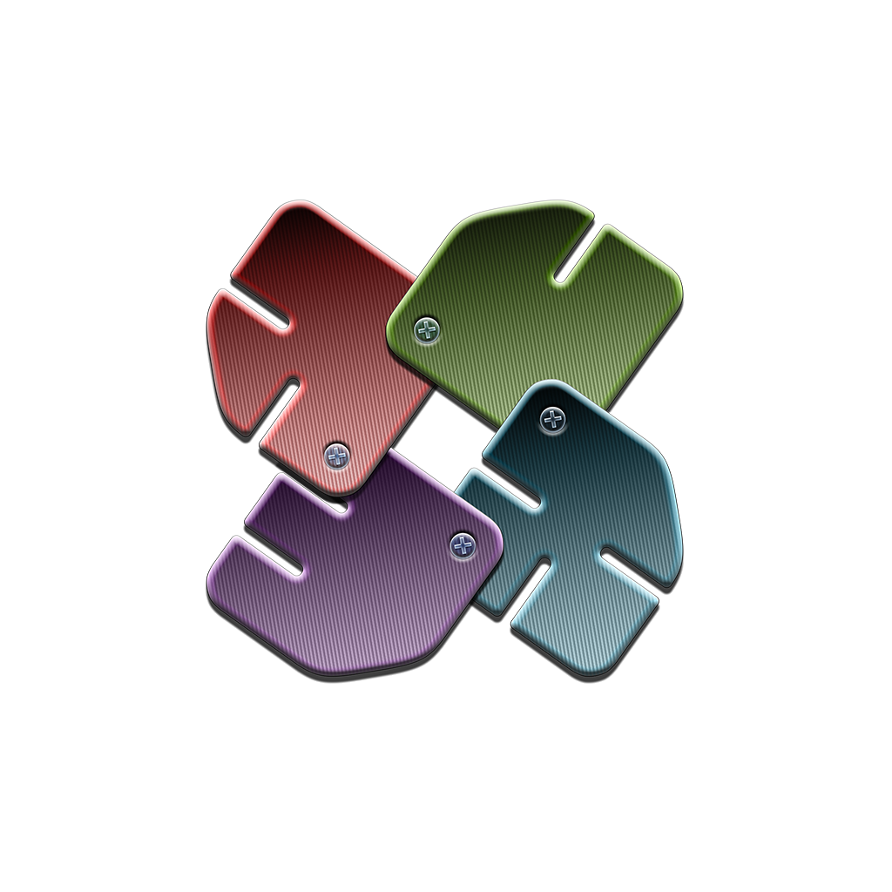
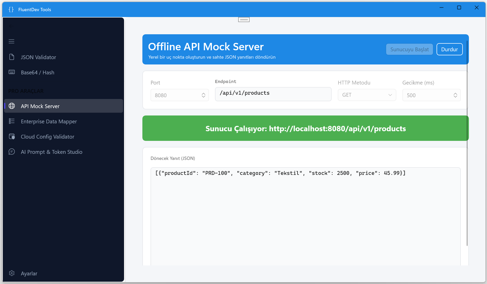
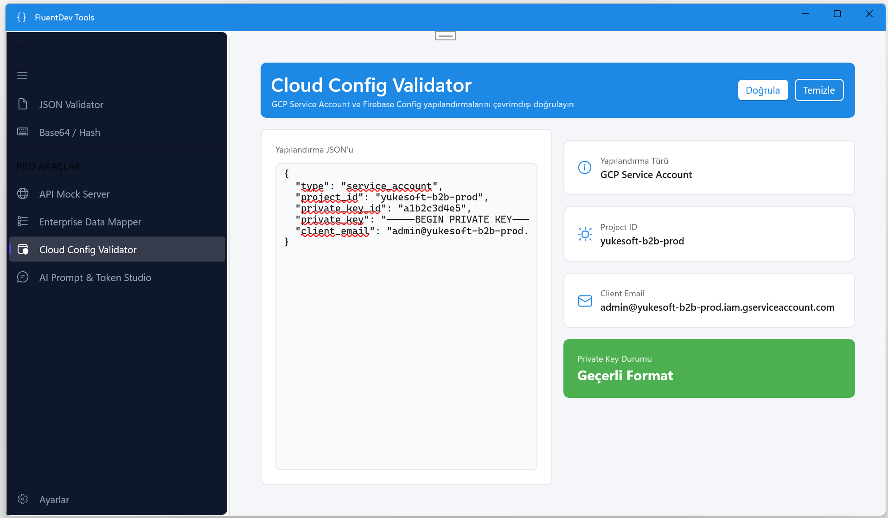

  
  <h1>FluentDev Tools</h1>
  
<b>The ultimate, 100% offline-first toolkit for modern developers.</b>

  
  

## 🚀 Overview
Tired of pasting your sensitive API keys, customer data, and private configurations into random web tools? 

**FluentDev Tools** is a high-performance, fully offline developer toolkit built with modern WinUI 3 architecture. Your data stays on your machine. Zero telemetry, zero external server calls.

## ✨ Features

### 🆓 Free Tools
- **JSON Validator & Formatter:** Instantly validate and debug complex JSON payloads.
- **Base64 Encoder/Decoder:** UTF-8 compliant fast encoding.

### 💎 Pro Tools (One-time Upgrade)
- **Offline API Mock Server:** Spin up a local mock server with latency simulation to test your frontend.
- **Enterprise Data Mapper:** Instantly convert complex JSON into production-ready C# classes and records.
- **Cloud Config Validator:** Validate Google Cloud (GCP) and Firebase configuration files in seconds.
- **AI Prompt Studio:** Combine prompts and estimate token costs locally.

## 📸 Screenshots

  
  

## 🛠 Installation
Download and install the verified package directly from the [Microsoft Store](https://apps.microsoft.com/store/detail/9PHV86ZR4JN8?cid=DevShareMCLPCS).

## 💬 Feedback & Support
Found a bug or have a feature request? We'd love to hear from you! 
Please open an issue in the [Issues tab](../../issues) of this repository.

---
*Built with WinUI 3 and C# by Yukesoft.*
